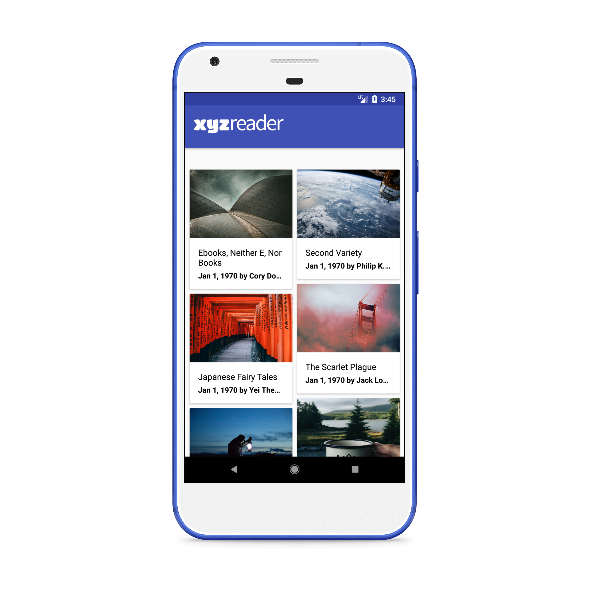
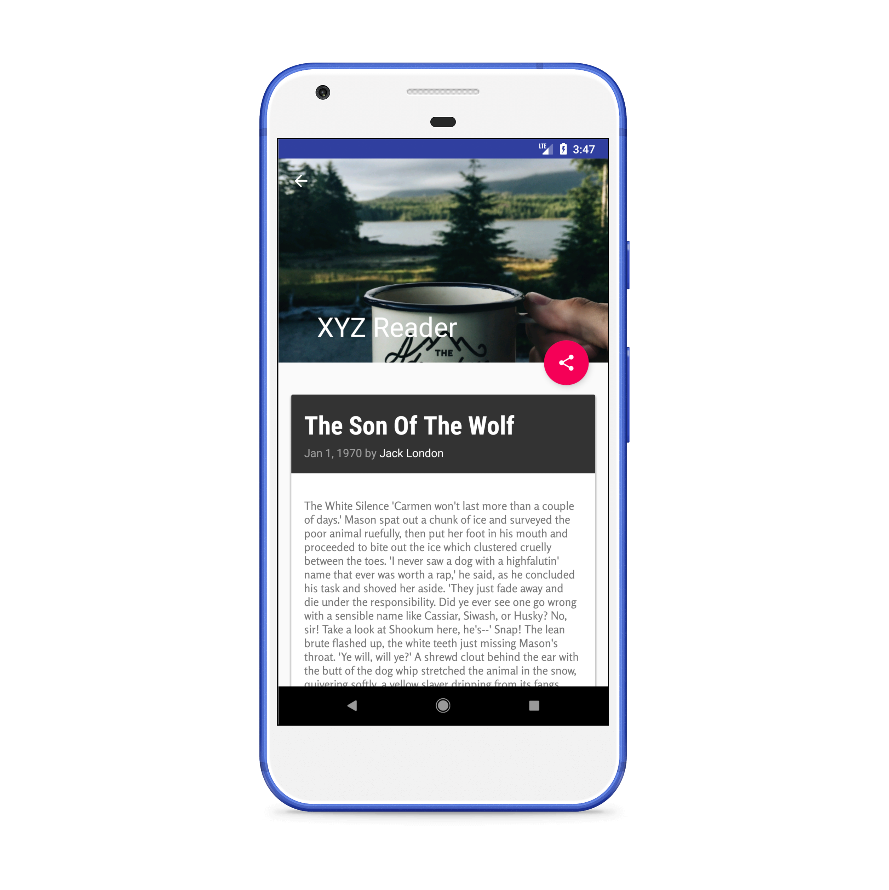
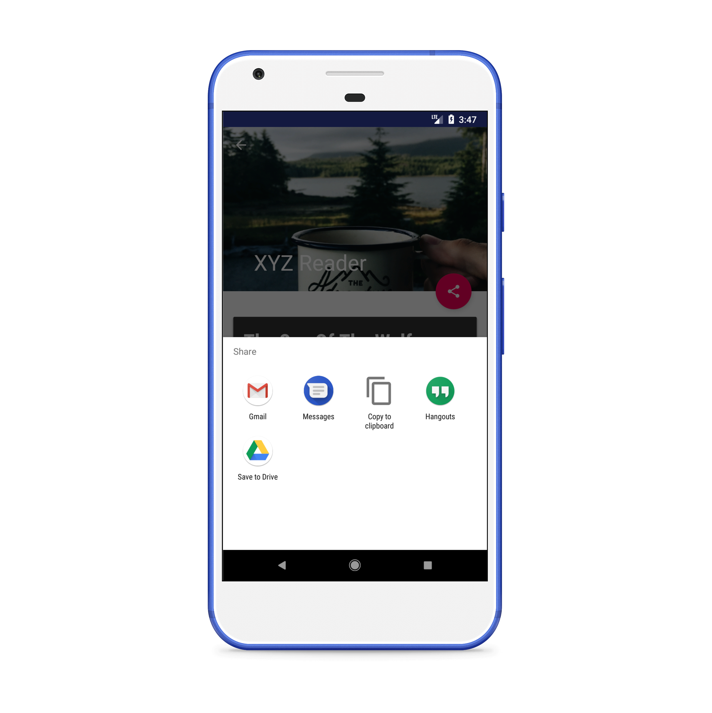
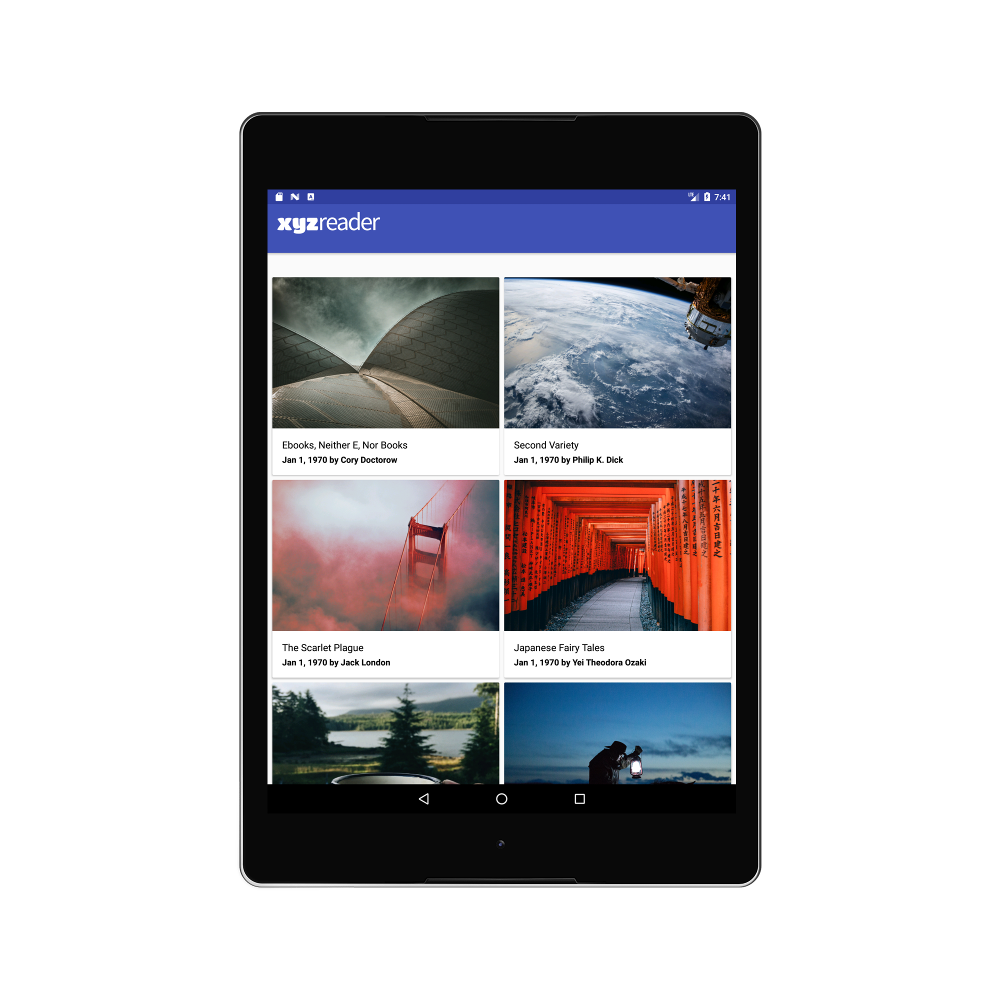
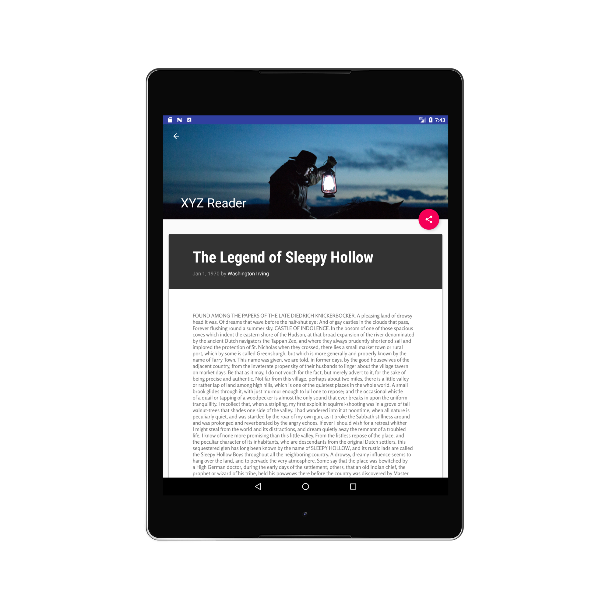

= XYZ Reader Starter Code

In this project, you will redesign an app to follow the Material Design guidelines and translate a set of static design mocks to a living and breathing app. 

## Project Overview
In this project, you will redesign an app to follow the Material Design guidelines and translate a set of static design mocks to a living and breathing app.

## Why this Project?
This project gives you an opportunity to improve an app’s design, a vital skill for building apps users will love. It also replicates a common developer task of updating and changing an app's design as new standards are released.

## What Will I Learn?
Through this project, you will:
- Understand the fundamentals of Android design.
- Apply Material Design guidelines to an mobile application.
- Separate an interface into surfaces.
- Effectively use transitions and motion.

## Required Tasks
- Download a zip file of the app.
- Read the UI Review in the next node.
- Spend time exploring the current state of the app, looking for ways it could be improved. The app will need multiple improvements. 
- Be sure to look specifically at issues called out in the UI Review. 
- Execute the improvements!
- Make a single GitHub repo with your code for the app and submit it through the Nanodegree portal. 

For detailed information on how your project will be assessed, see the [Rubric](https://review.udacity.com/#!/rubrics/63/view) here

## Screenshots

*Popular Movies was highly evaluated by certified Udacity code reviewer and was graded as "Exceeds Specifications".*
 
 
# Android Developer Nanodegree

